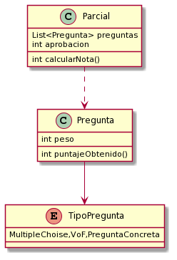

# CorrectorDeExamenesDDS

### Perdon por lo incompleto, hice lo que pude con el tiempo que tuve.

Diagrama de clases:
<br>


```java
Class Parcial{
int aprobacion; // Nota minima de aprobacion

List<Pregunta> preguntas; 
//Asumo que por constructor se me dan las preguntas del examen, o puedo tener un setter de preguntas.

int calcularNota(){
return this.puntajetotal() - aprobacion;
}

int puntajeTotal(){
return this.preguntas().sum(unaPregunta -> unaPregunta.puntajeObtenido());
}
}

Class Pregunta{
int peso;
int puntajeObtenido;
int puntajeObteido(){
return puntajeObtenido;
}
}

```
